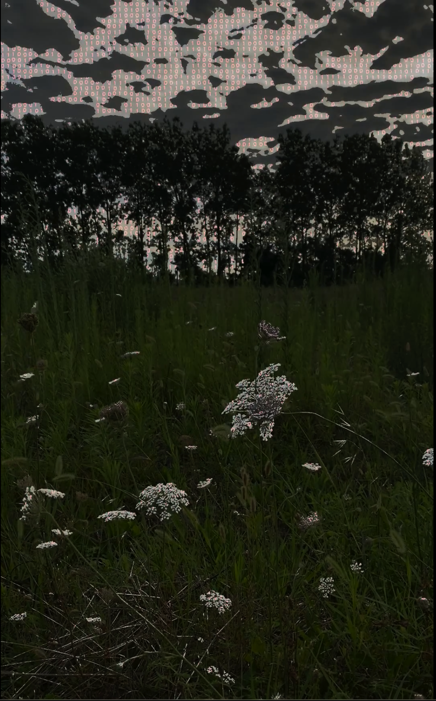
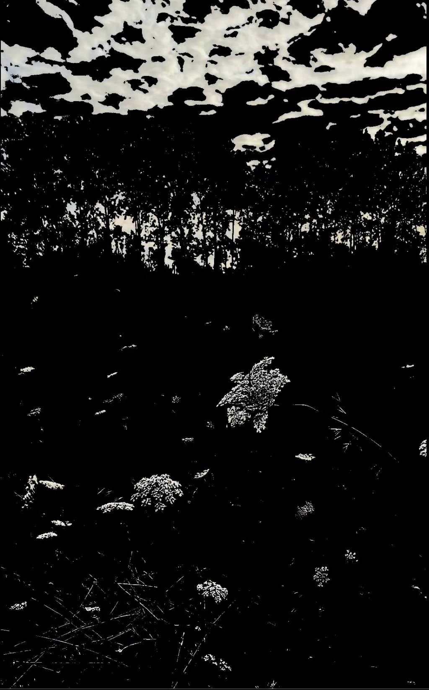
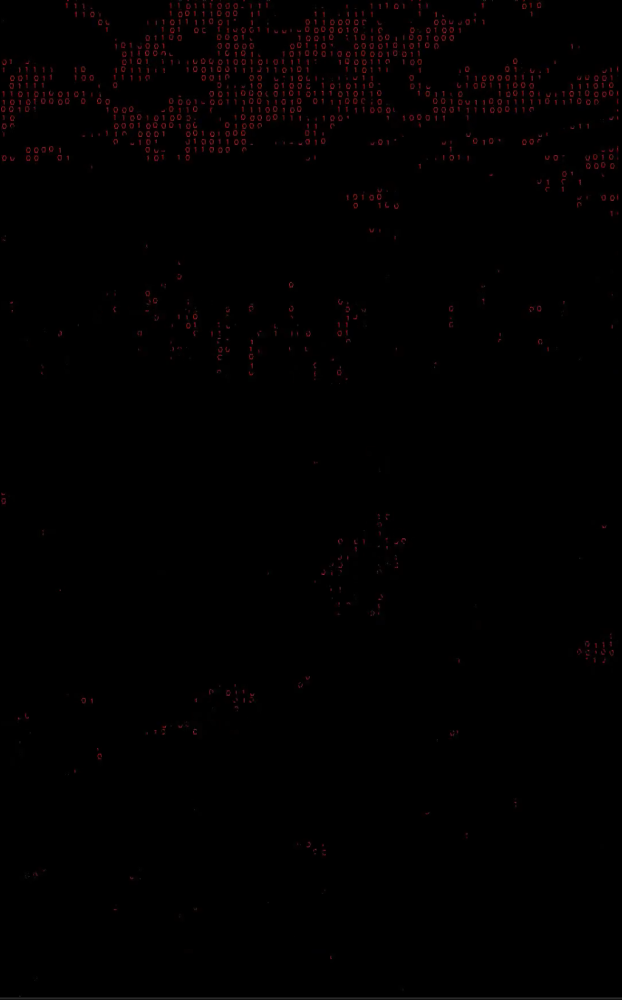

# 🧬 METAMORPHOSIS

> *"You may say I'm a dreamer, but I'm not the only one."* — **John Lennon**
>
> *"As Gregor Samsa awoke one morning from uneasy dreams, he found himself transformed..."* — **Franz Kafka**



## 🔬 Abstract (Özet)

**METAMORPHOSIS**, video verisini statik bir dosya formatı olarak değil; yaşayan, mutasyona uğrayan ve dijital ortamda evrimleşen biyolojik bir organizma olarak ele alan deneysel bir **Audio-Visual Glitch Art** projesidir.

Bir Biyoinformatikçi gözüyle; DNA dizileme verisindeki (FASTQ) kaotik düzeni, görsel medyanın (MP4) rijit yapısına enjekte etmeyi amaçlar. Proje, gerçekliği **Fenotip (Görüntü)** ve **Genotip (Veri)** olarak ikiye ayırır ve bunları prosedürel ses tasarımıyla (Sonification) yeniden sentezler.

## 🧠 Konsept: `imagine-fastq`

Bu proje, sanatçının genomik veri bilimi (Dry-lab) geçmişi ile dijital sanatın kesişim noktasında durur. İsimlendirme ve yapı üç temel ayağa oturur:

1.  **Imagine:** Sınırların kalktığı, verinin özgürleştiği bir ütopya (Lennon).
2.  **FASTQ:** Biyolojik verinin ham hali. Biz burada pikselleri `ACGT` yerine `0` ve `1` bazlarına indirgiyoruz.
3.  **Metamorphosis:** Görüntünün, Kafkaesk bir süreçle tanınmaz hale gelip yeni bir forma (Noise/Glitch) dönüşmesi.

---

## 🧪 Görsel Kanıtlar (Visual Evidence)

### Phase 1: Isolation (The Void)
Görüntüdeki organik dokular (Luma eşiği ile) ayrıştırılır. Geriye sadece iskelet kalır.


### Phase 2: Infection (Red Code)
Ayrıştırılan dokulara "Binary Rain" enjekte edilir. Bu aşama, verinin görseli ele geçirdiği andır.


---

## 🛠️ Teknik Mimari (The Engine)

Sistem, Python tabanlı modüler bir **VJ Mikseri** gibi çalışır. Görüntüyü analiz ederken eş zamanlı olarak **Prosedürel Ses Sentezi (DSP)** yapar. Önceden kaydedilmiş hiçbir ses kullanılmaz; duyduğunuz her şey o an kod tarafından üretilir.

### Audio-Visual Sync Mekanizması:
* **State: Organic (Mix)** $\rightarrow$ **Sound: Deep Abyss Drone (LFO Modulated)**
    * *Teknik:* 40Hz Sinüs dalgası, okyanus derinliği hissi için genlik modülasyonu ile dalgalandırılır.
* **State: Skeletal (B&W)** $\rightarrow$ **Sound: Cardiac Pulse**
    * *Teknik:* 60Hz Sinüs darbesi, biyolojik kalp atışını simüle eden Attack/Decay zarfı (envelope) ile işlenir.
* **State: Digital (Red)** $\rightarrow$ **Sound: Sonar Ping**
    * *Teknik:* Yüksek frekanslı sinüs dalgaları, veri akışını temsil eden kısa sönümlenmelerle tetiklenir.

## 🚀 Kurulum ve Deneysel Kullanım

Laboratuvar ortamını (Environment) kurmak için:

```bash
# Repoyu klonlayın
git clone [https://github.com/imagine-fastq/METAMORPHOSIS.git](https://github.com/imagine-fastq/METAMORPHOSIS.git)
cd METAMORPHOSIS

# Yaşam destek ünitelerini (Dependencies) yükleyin
pip install -r requirements.txt